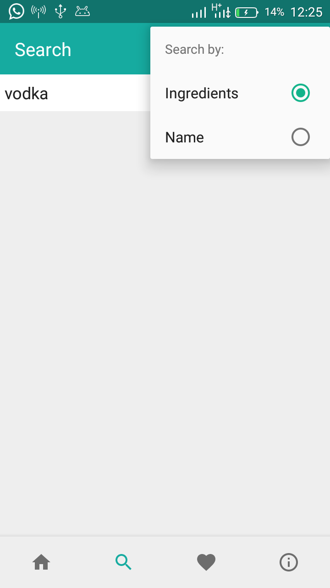

## Cocktail  :cocktail:

  
  
   This is an android app for cocktail lovers. It shows recipes for both _**Alcoholic**_ and _**Non-Alcoholic**_ drinks.  
  
It is powered [the cocktail db](https://thecocktaildb.com) API which can be accessed [here](https://thecocktaildb.com/api.php).   
>No API keys or signup required  
  
<h3 id="contribution"> Table of Contents </h3>  
  
1. [Contribution](#contribution)  
2. [Download](#download)  
3. [Goals](#goals)  
4. [Look](#look)  
5. [Credits](#credits)  
6. [Support](#support)  
7. [License](#license)  
  
<h3 id="contribution"> Contribution</h3>
  
1. Fork  
2. Create feature branch:  `git checkout -b my-feature-branch`  
3. Commit changes:  `git commit -am 'new awesome feature'`  
4. Push to the branch:  `git push origin my-feature-branch`  
5. Submit a pull request   
>You get it :smiley:   
<h3 id="download"> Download</h3>
  
Download the app [here](https://github.com/Kevin-Kip/Cocktail/raw/master/apk/Cocktail.apk)  
  
<h3 id="goals"> Goals</h3>  

- [x] Can fetch stuff online :laughing:  
- [x] Search drinks  
- [x] Filter drinks by category and order {ASC and DESC}  
- [x] Save Favorites  
- [x] Network Connectivity check    
  
<h3 id="look"> Look and Feel</h3>
  
   
   
   
  
  <h3 id="credits">Credits</h3>
  
1. [Volley](https://developer.android.com/training/volley/) networking library.
2. [TheCocktailDB](https://thecocktaildb.com)
3. [Picasso](http://square.github.io/picasso/) image loading library.
4. [GSON](https://github.com/google/gson)  serialization library.

<h3 id="support"> Support </h3>  
  
  
  
<h3 id="license"> License </h3>  
  
[MIT License](/LICENSE)  
  